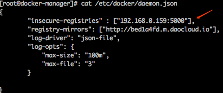

# 微服务docker运维手册 #

#### 如何制作微服务的镜像？
> 在`suidifu-springcloud`项目下执行`mvn clean install`命令即可生成对应的Docker镜像并上传到Docker私服上。

#### 无法push镜像到私服上去

>  这是因为我们启动 的registry服务不是安全可信赖的。 
对于`linux`系统，可以这样修改：
修改docker的配置文件`/etc/docker/daemon.json`，添加下面的内容:
`"insecure-registries" : ["192.168.0.159:5000","120.26.102.180:5000"],`,如下图：

> 然后重启docker后台进程，命令`sudo service docker restart`。 
对于`mac`系统，可以这样修改：

> 

#### 如何获取镜像

> 执行命令docker pull 镜像名:tag,如：`docker pull 120.26.102.180:5000/suidifu/modify-overdue-fee-consumer:1.0.0`

#### docker测试环境-docker镜像私服说明
> 进入192.168.0.159大主机后，进入192.168.122.46机器，在该机器上执行命令如下:
>
1. `mount -t nfs 192.168.0.159:/home/5veda/data/registry /registry/storage`
2. ` docker run -d     -p 5000:5000     --name registry     --restart=always     -v /registry/storage:/var/lib/registry  registry:2`
