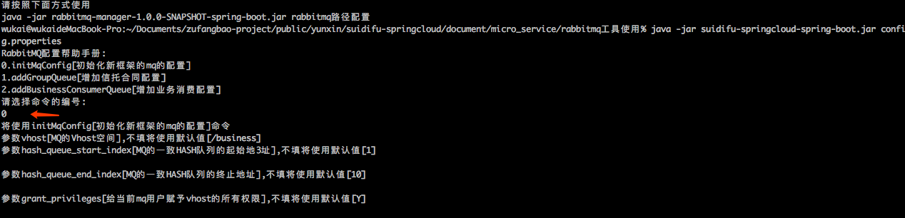
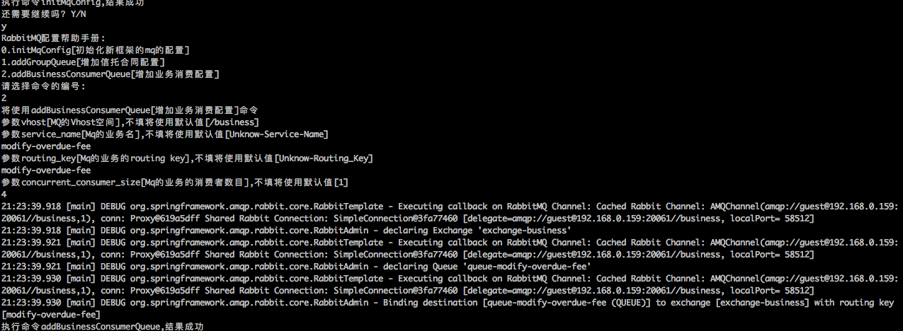

# rabbit_manager使用说明

## 工具jar包使用方式

+ 修改config.properties，修改rabbit mq端口、账号密码

+ 执行命令`java -jar suidifu-springcloud-spring-boot.jar /Users/wukai/Documents/zufangbao-project/public/yunxin/suidifu-springcloud/document/micro_service/rabbitmq工具使用/config.properties[绝对路径]`

+ 选择`0`，第一遍初始化新框架的mq的配置，按照提示操作

+ 然后选择继续`Y`，选择`2`，按提示操作,这里选择以变更逾期费用为例，routing_key为`modify-overdue-fee`

+ 退出即可

操作实例图:

